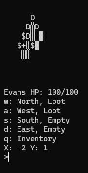
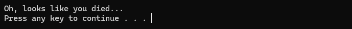

# Tile Wanderer
Put this project onto github for the purposes of archiving old projects. Made in 2017.

## Overview

A procedurally generated console turn based game. Kill enemies to collect better weapons and loot.



My goal was to learn C++ by creating a simple game that ran through the console. I recreated the game twice to learn more in the [second version](https://github.com/EvanGyori/Tile-Wander-2).

The second version is cleaner but has less content.

Now, when I go back to look at the code of the project, it looks very goofy. Half of the comments explaining syntax were just wrong. I handmade very long pieces of code that could simply be put into a for loop. And all of the code was spaghetified into one file.



## Usage
Works on Windows, linux, and mac.

Run the Following in a build directory
```
cmake <project-source-directory>
cmake --build .
```
Creates an executable called `TileWander`.

Controls are shown below the map. For example, type in w and hit enter to move up.
